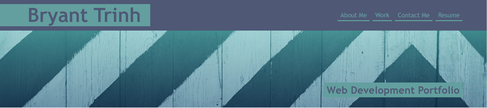
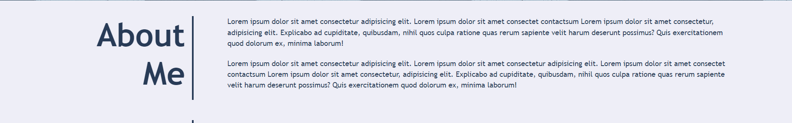
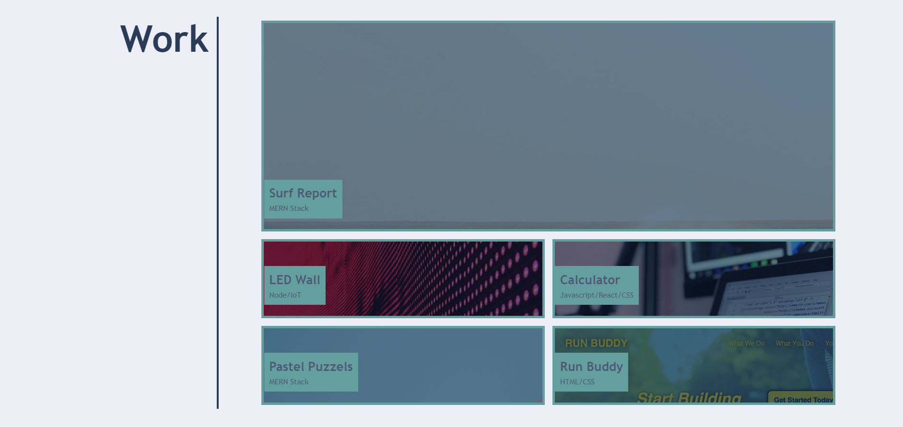

# Project Title: Professional Web Development Portfolio Template

## Description

What was your motivation?
- My motivation in building this portfolio was to be able to present my web developements to employers.

Why did you build this project?

- I built this this project in order to store all my important projects, in an easily navigateable website, to present to future employers.

What problem does it solve?
- This portfolio template solves the issue of not having a personal space to hold projects. With this portfolio template, we are able to add 5 projects, a way to contact us, and being able to add social media websites

What did you learn?
- In creating this portfolio, I was able to grasp the concepts of CSS grid, flexbox, and media queries. Using all of these techniques, I was able to make a portfolio that works on mobile devices and provides a clean visual interface for employers.

## Usage
'''md

'''

## License
- MIT License.contact

## Features
- HTML that incorporates flexbox, CSS grid, media queries for non-desktop users, and hover effects.

## Tests
1. Open the index.html file in a live server. 
2. Navigation bar at the top is clickable but have placeholders that will later be filled out.
3. You are able to hover your cursor over each image, under the header: "Work", where the image will darken as you hover of it.
4. Under the "Contact Me" footer section, you are able to click on the phone number, the website address, Github, Twitter, and Spotify. They all have placeholders and will be filled out later on.